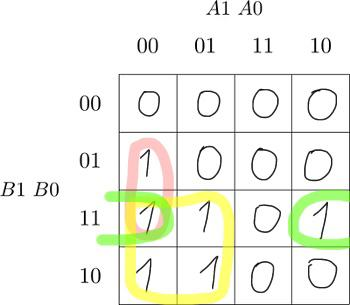
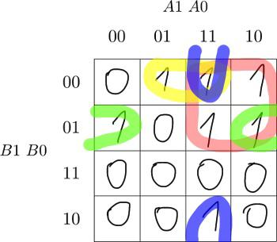

# Lab 2: Yaroslav Shapoval

### 2-bit comparator

1. Karnaugh maps for other two functions of 2-bit comparator:

   B Greater than A:

   

   A Greater than B:

   

2. Mark the largest possible implicants in the K-map and according to them, write the equations of simplified SoP (Sum of the Products) forms of both "greater than" functions and also both simplified PoS (Product of the Sums) forms.

<!--
   
-->

### 4-bit comparator

1. Listing of VHDL stimulus process for 4-bit comparator from testbench file (`testbench.vhd`) with at least one assert (use BCD codes of your student ID digits as input combinations). Always use syntax highlighting, meaningful comments, and follow VHDL guidelines:

   Last two digits of my student ID: **3258**

```vhdl
    p_stimulus : process is
    begin
        -- Report a note at the beginning of stimulus process
        report "Stimulus process started";

        -- First test case
        sig_d <= "0011";
        sig_c <= "0010";
        sig_b <= "0101";
        sig_a <= "1000";
        wait for 100 ns;
        -- Expected output
        assert (
            (sig_b_greater = '0') and
            (sig_b_a_equal = '1') and
            (sig_a_greater = '0')
          )
          -- If false, then report an error
          report "Input combination COMPLETE_THIS_TEXT FAILED"
          severity error;

        -- Report a note at the end of stimulus process
        report "Stimulus process finished";
        wait;
    end process p_stimulus;
```

